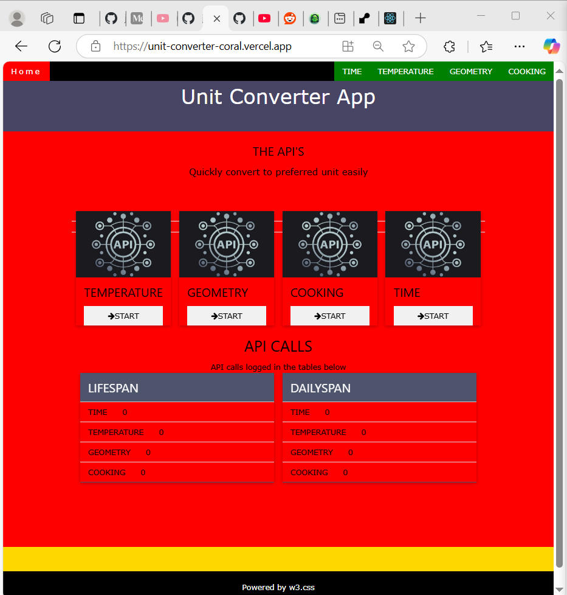
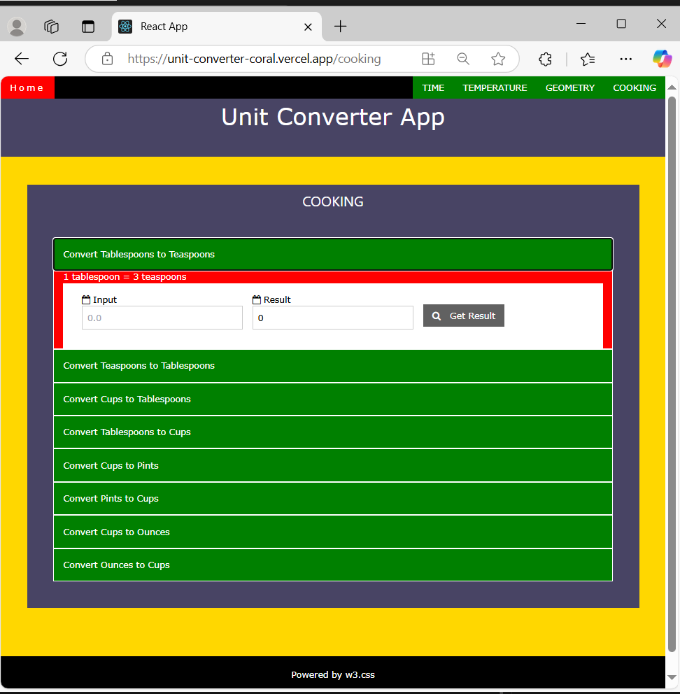
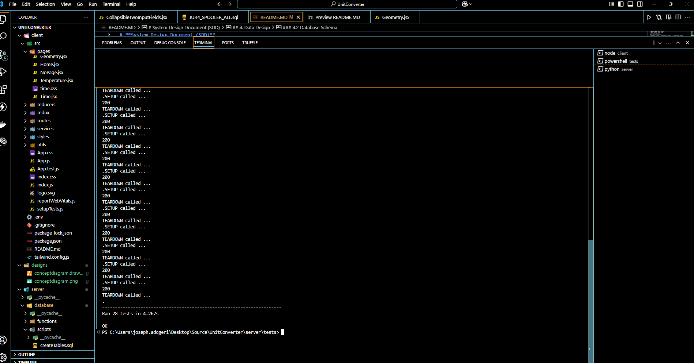

# **System Design Document (SDD)**  
## **Unit Converter System**  
**Version:** 1.1
**Date:** December 30, 2024

---

## Description
This is a FullStack Application (ReactJS + Flask) ,which calculates and converts measurements while storing user api calls history.


## Authors

- [@jadogeri](https://www.github.com/jadogeri)

## Screenshots

|         |  |
| --------------------------------------- | --------------------------------------- |
|  |                                         |

## Table of Contents

   <ul>
      <li><a href="#1-introduction">1. Introduction</a>
        <ul>
          <li><a href="#11-purpose">1.1 Purpose</a> </li>
          <li><a href="#12-scope">1.2 Scope</a> </li>
          <li><a href="#13-intended-audience">1.3 Intended Audience</a> </li>
        </ul>
      </li>
    </ul>
    <ul>
      <li><a href="#2-system-overview">2. System Overview</a>
        <ul>
          <li><a href="#21-system-objectives">2.1 System Objectives</a> </li>
          <li><a href="#22-user-types">2.2 User Typres</a> </li>
          <li><a href="#23-assumptions-and-constraints">2.3 Assumptions and Constraints</a> </li>
          <li><a href="#24-system-context-diagram">2.4 System Context Diagram</a> </li>
        </ul>
      </li>
    </ul>
    <ul>
      <li><a href="#3-system-architecture">3. System Architecture</a>
        <ul>
          <li><a href="#31-high-level-architecture">3.1 High Level Architecture</a> </li>
          <li><a href="#32-technology-stack">3.2 Technology Stack</a> </li>
          <li><a href="#33-deployment-artifacts">3.3 Deployment Artifacts</a> </li>
        </ul>
      </li>
    </ul>
    <ul>
      <li><a href="#4-data-design">4. Data Design</a>
        <ul>
          <li><a href="#41-data-entities-and-relationships">4.1 Entities and Relationships</a> </li>
          <li><a href="#42-database-conceptual-schema">4.2 Database Conceptual Schema</a> </li>
          <li><a href="#33-deployment-artifacts">3.3 Deployment Artifacts</a> </li>
        </ul>
      </li>
    </ul> 
    <ul>
      <li><a href="#5-installation">5. Installation</a>
      </li>
    </ul> 
    <ul>
        <li><a href="#6-usage">6. Usage</a>
        <ul>
            <li><a href="#61-run-locally">6.1 Run Locally</a> </li>
            <ul>
              <li><a href="#611-run-server-flask-application">6.1.1 Server (Flask Application)</a> </li>
              <li><a href="#612-run-client-reactjs-application">6.1.2 Client (ReactJS Application)</a> </li>
            </ul>
        </ul>
        </li>
    </ul> 
    <ul>
        <li><a href="#7-tests">7. Tests</a>
        </li>
    </ul>    
    <ul>    
        <li><a href="#8-license">8. License</a>
        </li>
    </ul> 
    <ul> 
        <li><a href="#9-references">9. References</a>
        </li>
    <ul>
    

## **1. Introduction**  
### **1.1 Purpose**  
This document outlines the system architecture, components, and design considerations for Unit Converter System. The goal is to provide a robust platform for individuals and businesses to calculate and convert to preferred units.

### **1.2 Scope**  
The system will allow users to:  
- Submit personal property declarations online.  
- Integrate seamlessly with the parish tax collection system for calculations and payments.  

### **1.3 Intended Audience**  
- System Developers and Administrators  
- End Users (Individuals and Businesses)  

---

## **2. System Overview**  
### **2.1 System Objectives**  
- Simplify unit conversion for end users.  

### **2.2 User Types**
Unit Converter supports the following types of users.

|User Type|Description|
|-|-|
|Casual Users|End users can access api hits statistics and make calculations.|

### **2.3 Assumptions and Constraints**  
- Users must have internet access to report online.  
- Development will be completed by Feburary 20, 2025.

### **2.4 System Context Diagram**  

---

## **3. System Architecture**  
### **3.1 High-Level Architecture**  
The system follows a **three-tier architecture**:  
1. **Presentation Layer**: A responsive web interface accessible on desktop devices.  
2. **Application Layer**: Implements business logic that manages the reading and writing of user input to the **Data Layer**.
3. **Data Layer**: Handles storage and retrieval of user data.

### **3.2 Technology Stack**  
- **Programming Languages**: Python, JavaScript, HTML, CSS and SQL
- **IDE**: Visual Studio Code (VSCode)
- **Frontend Frameworks**: ReactJS 
- **Backend Frameworks**: Flask
- **Database**: SQLite3
- **Hosting**: Render.com and Vercel.com
- **Source Control**: Git and GitHub
- **CI/CD**: GitHub Actions

### **3.3 Deployment Artifacts**
- **Database**: Collection of SQL scripts that are executed on a Sqlite3 database instance.
- **Backend Application**: build and run Flask application instance on Render.com
- **Frontend Application**: build and run ReactJS application instance on Vercel.com

---

## **4. Data Design**  
### **4.1 Data Entities and Relationships**
|Entity|Description|
|-|-|
|SERVICE|User account information used to authenticate users.|
|DAILYSPAN|General information about a form that was submitted using OPOPPR.|
|LIFESPAN|Lookup table of form types. Currently only LAT5 is supported.|

### **4.2 Database Conceptual Schema**  


---
## **5. Installation**  
* [Download and install Python](https://www.python.org/downloads/)
* [Download and install NodeJS](https://nodejs.org/en/download)
* [Download and install Pip](https://pip.pypa.io/en/stable/installation/)

---

## **6. Usage**  
### **6.1 Run Locally**

1 Open command prompt or terminal.

2 Type command git clone https://github.com/jadogeri/UnitConverter.git then press enter.

```bash
  git clone https://github.com/jadogeri/UnitConverter.git
```

3 Enter command cd UnitConverter then press enter.

```bash
  cd UnitConverter
```

#### **6.1.1 Run Server (Flask Application)**

1 Navigate to Server direcory (Flask project) using command cd server.

```bash
  cd server
```

2 Type pip install -r requirements.txt to install dependencies.

```bash
  pip install -r requirements.txt
```
3 Type python server.py to run server

```bash
  python server.py
```

#### **6.1.2 Run Client (ReactJS Application)**

1 Navigate to Client direcory (ReactJS project) using command cd client.

```bash
  cd client
```

2 Type npm install --force to install dependencies.

```bash
  npm install --force
```
3 Type npm start to run client.

```bash
  npm start
```

---
## **7. Tests**  

1. Navigate to project src folder entering command cd UnitConverter/server.

```bash
  cd /UnitConverter/server
```
2. Type command pip install -r requirements.txt, then press Enter. 

```bash
  pip install -r requirements.txt
```
3. Navigate to tests directory using cd testscommand. 

```bash
  cd tests
```
4. Type command python tests.py to run all tests. 

```bash
  python tests.py
```


---
## **8. License**  

[LICENSE](/LICENSE)

---

## **9. References**

* FreeCodeCamp : [Frontend Web Development: (HTML, CSS, JavaScript, TypeScript, React)](https://www.youtube.com/watch?v=MsnQ5uepIa).
* Dipesh Malvia : [Learn Node.js & Express with Project in 2 Hours](https://www.youtube.com/watch?v=H9M02of22z4&t=140s).
* HuXn WebDev : [Mastering Redux Toolkit and RTK Query](https://www.youtube.com/watch?v=CI8VeG0GI-M&t=186s).
* An Insightful Techie : [- Basic Introduction to Unit Testing in Python using unittest framework](https://www.youtube.com/watch?v=HKTyOUx9Wf4&t=363s).
* Caleb Curry : [Python Programming 53 - Sys.path and Changing Module Paths](https://www.youtube.com/watch?v=5z5nALNandM).
* FreeCodeCamp : [Learn Python - Full Course for Beginners [Tutorial]](https://www.youtube.com/watch?v=rfscVS0vtbw).